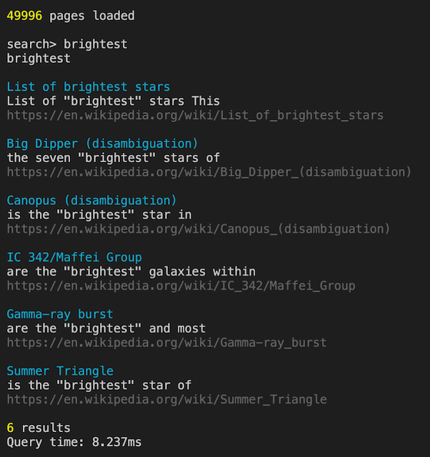

# Search engine

Simple search engine with focus on performance.

- Search single or multiple words
- Quotes to match exact
- Ranking on title and url



Example:

```typescript
engine = new Engine();
engine.add({
  text:
    'Jupiter is the fifth planet from the Sun and the largest in the Solar System. It is a gas giant with a mass one-thousandth that of the Sun, but two-and-a-half times that of all the other planets in the Solar System combined. Jupiter is one of the brightest objects visible to the naked eye in the night sky, and has been known to ancient civilizations since before recorded history. It is named after the Roman god Jupiter.[18] When viewed from Earth, Jupiter can be bright enough for its reflected light to cast visible shadows,[19] and is on average the third-brightest natural object in the night sky after the Moon and Venus.',
  url: 'https://en.wikipedia.org/wiki/Jupiter',
});
engine.add({
  text:
    'Saturn is the sixth planet from the Sun and the second-largest in the Solar System, after Jupiter. It is a gas giant with an average radius of about nine times that of Earth.[18][19] It only has one-eighth the average density of Earth; however, with its larger volume, Saturn is over 95 times more massive.[20][21][22] Saturn is named after the Roman god of wealth and agriculture; its astronomical symbol (♄) represents the god´s sickle.',
  url: 'https://en.wikipedia.org/wiki/Saturn',
});
```

```typescript
engine.search('brightest');
// [
//   {
//     ingress: 'of the "brightest" objects visible ... the third "brightest" natural object',
//     url: 'https://en.wikipedia.org/wiki/Jupiter'
//   }
// ]
```

```typescript
engine.search('planet sixth');
// [
//   {
//     ingress: 'is the "sixth planet" from the',
//     url: 'https://en.wikipedia.org/wiki/Saturn'
//   }
// ]
```

```typescript
engine.search('"from the Sun" Moon');
// [
//   {
//     ingress: 'fifth planet "from the Sun" and the ... after the "Moon" and Venus',
//     url: 'https://en.wikipedia.org/wiki/Jupiter'
//   }
// ]
```

## Benchmark

- 50000 [wikipedia abstracts](https://dumps.wikimedia.org/enwiki/latest/enwiki-latest-abstract.xml.gz) added to index
- 121295 words loaded (no stop words)
- Tested on 2018 MacBook Pro.

Test command: npm run bench

```typescript
const result = engine.search('philosophy psychology');
```

Result in 2.632ms

```js
[
  {
    ingress:
      'branches of "philosophy" and psychology ... philosophy and "psychology" concerning emotion',
    url: 'https://en.wikipedia.org/wiki/Affection',
  },
  {
    ingress:
      'In developmental "psychology" and moral ... and bioethical "philosophy" autonomy from',
    url: 'https://en.wikipedia.org/wiki/Autonomy',
  },
  {
    ingress:
      'such as "philosophy" and psychology ... philosophy and "psychology"',
    url: 'https://en.wikipedia.org/wiki/Social_studies',
  },
  {
    ingress:
      'Hague studied "philosophy" and psychology ... philosophy and "psychology" at Groningen',
    url: 'https://en.wikipedia.org/wiki/Johannes_Jacobus_Poortman',
  },
  {
    ingress:
      'Encyclopedia of "Philosophy" which begins ... in moral "psychology" ethical theory',
    url: 'https://en.wikipedia.org/wiki/Suffering',
  },
];
```

```typescript
const result2 = engine.search('"carl friedrich" german');
```

Result in 1.021ms

```js
[
  {
    ingress:
      'valued functions "German" mathematician Carl ... German mathematician "Carl Friedrich" Gauss 1777',
    url: 'https://en.wikipedia.org/wiki/Number_theory',
  },
  {
    ingress:
      'also spelled "Carl Friedrich" Bahrdt was ... an unorthodox "German" Protestant biblical ... characters in "German" learning',
    url: 'https://en.wikipedia.org/wiki/Karl_Friedrich_Bahrdt',
  },
  {
    ingress:
      'Franz Ludwig "Carl Friedrich" Passow September ... was a "German" classical scholar',
    url: 'https://en.wikipedia.org/wiki/Franz_Passow',
  },
];
```

## TODO

- [x] Search single word
- [x] Search multiple words
- [x] Search result introduction
- [x] Search quotes
- [x] Stopwords
- [ ] Stemming
- [x] Ranking of results, higher rank if searched words is in:
  - [x] Title
  - [x] Url
- [x] Store index as files
- [x] Store index as binary
  - [x] Handle collisions
